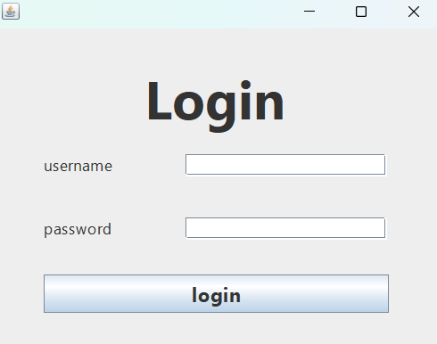
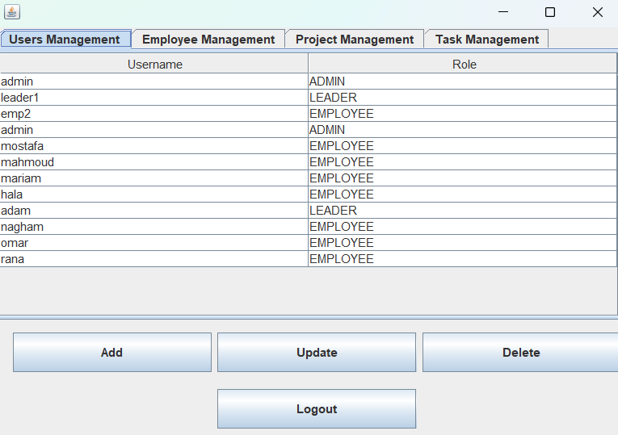
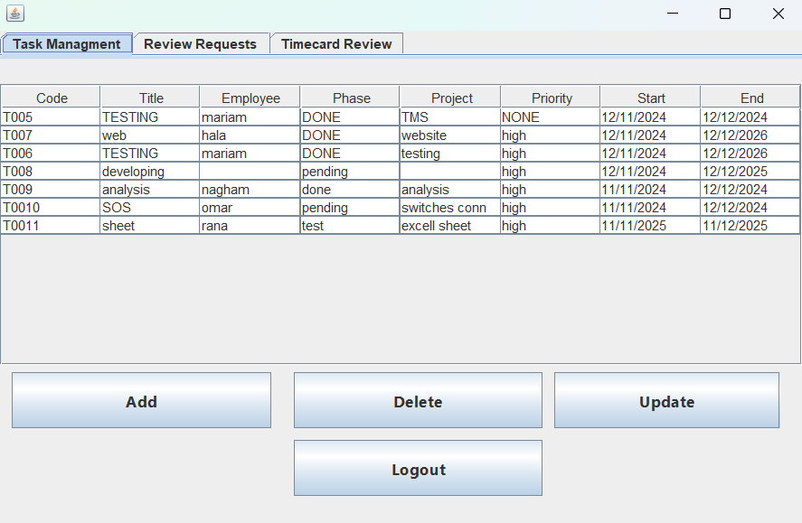
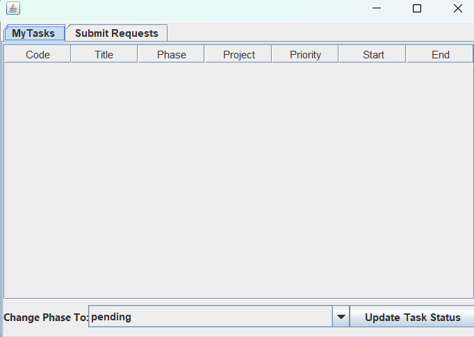

# Task Management System

<div align="center">


**A desktop task management application with role-based dashboards for admins, leaders, and employees.**

[View Repository](https://github.com/malakmohamed172/Task-Management-system)

</div>

---

## Preview

### Login Page

Secure role-based entry point for admins, leaders, and employees.



### Admin Page

Admin dashboard for managing users, employees, projects, and tasks.



### Leader Page

Leader dashboard for task management, request review, and timecard review.



### Employee Page

Employee workspace for assigned tasks, task status updates, and request submission.



---

## UI Highlights

- **Role-based navigation**: users are routed to the right dashboard after login.
- **Tabbed dashboards**: each role gets organized panels for the work they need most.
- **Table-driven management**: tasks, users, employees, projects, timecards, leaves, and missions are displayed in clear Swing tables.
- **Action buttons**: add, update, delete, approve, disapprove, refresh, check in, and check out workflows are available from the interface.
- **Local file storage**: project data is saved in simple text files under the `data` directory.

---

## Dashboards

### Admin

The admin dashboard focuses on system control:

- User management
- Employee management
- Project management
- Task management

### Leader

The leader dashboard supports team operations:

- Create, update, and delete tasks
- Review team timecards
- Approve or disapprove leave requests
- Approve or disapprove mission requests

### Employee

The employee workspace keeps daily work simple:

- View assigned tasks
- Update task phase
- Check in and check out
- Submit leave requests
- Submit mission requests

---

## Project Structure

```text
TaskManagementSystem2/
+-- TaskManagementSystem2/
    +-- data/                  # Text-file data storage
    +-- lib/                   # Required Swing layout dependency
    +-- src/
    |   +-- taskmanagementsystem2/
    |   +-- tms/
    |       +-- gui/           # Swing frames and dashboards
    |       +-- *.java         # Core models and managers
    +-- nbproject/             # NetBeans project configuration
    +-- build.xml
    +-- manifest.mf
```

---

## Run Locally

From the nested project folder:

```powershell
git clone https://github.com/malakmohamed172/Task-Management-system.git
cd .\Task-Management-system
cd .\TaskManagementSystem2\TaskManagementSystem2
java -cp ".\build\classes;.\lib\AbsoluteLayout-RELEASE150.jar" tms.Main
```

The project is a NetBeans Java project, so it can also be opened directly in NetBeans.

---

## Contributor

<table>
  <tr>
    <td align="center">
      <a href="https://github.com/malakmohamed172/">
        
        <br />
        <sub><b>Malak Mohamed</b></sub>
      </a>
    </td>
  </tr>
</table>
